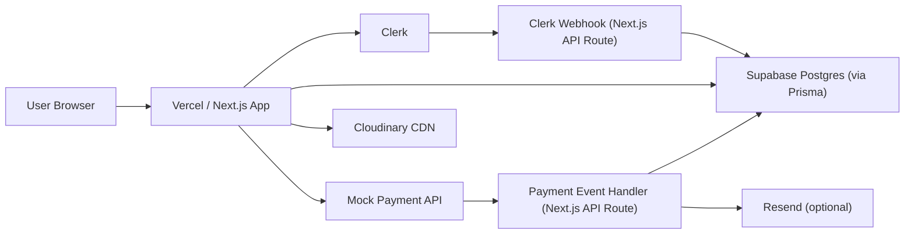

# BlushCo Cloud Backend Architecture (Academic Project)

This document defines the end-to-end cloud backend architecture for BlushCo as an academic project focused on cloud architecture, security fundamentals, and UI/UX design.

## 0) Project Constraints

- No real payment processing.
- No real money movement.
- Checkout must be simulated for learning/demo purposes.
- Security controls should still be implemented as if production (auth, validation, least privilege, webhook-style verification patterns where relevant).

## 1) Technology Stack

| Component | Service | Free-tier-friendly baseline | Purpose in BlushCo |
| --- | --- | --- | --- |
| Frontend + API routes | Next.js (App Router) | App code managed in repo | UI, SSR/Server Components, secure server-side API logic |
| Hosting + edge delivery | Vercel (Hobby) | Hobby plan limits (verify current plan caps) | Global deployment, CDN, serverless execution |
| Relational database | Supabase Postgres | Small production starter tier | Source of truth for products, users, orders |
| ORM + schema | Prisma | Open source | Type-safe DB access and migrations |
| Authentication | Clerk | MAU-based free tier | Sign-up/sign-in, session management, JWTs |
| Media storage + optimization | Cloudinary | Credit-based free tier | Product images, transforms, optimized delivery |
| Payment simulation | Internal mock gateway (`/api/payments/simulate`) | Fully free | Simulates payment states: success, fail, pending |
| Transactional email (optional) | Resend | Monthly email free tier | Demo order confirmation emails |

## 2) High-Level System Diagram

## 3) End-to-End Request Flow

1. Browse products
   - Request: `GET /shop` (Server Component)
   - Next.js reads product catalog from Postgres through Prisma.
   - Product image URLs are Cloudinary delivery URLs.

2. Authenticate user
   - User signs in/up with Clerk UI components.
   - Clerk webhook hits `POST /api/webhooks/clerk`.
   - Route upserts user row in `User` table (using Clerk `user.id` as primary key).

3. Manage cart
   - Cart state remains client-side for responsiveness (Zustand/Context + localStorage).
   - Server is source of truth for pricing and stock at checkout time.

4. Start simulated checkout
   - Request: `POST /api/checkout`.
   - Server recalculates line totals from DB product prices.
   - Server creates a simulated payment intent/session in DB with status `PENDING`.

5. Simulate payment result
   - Request: `POST /api/payments/simulate` with scenario (`success`, `failed`, `pending`).
   - Server validates user/session ownership and transitions payment state.
   - On `success`: create `Order` + `OrderItem` in one DB transaction.
   - Optional: send receipt with Resend.

## 4) API Surface (Suggested)

| Route | Method | Auth | Runtime | Responsibility |
| --- | --- | --- | --- | --- |
| `/api/webhooks/clerk` | `POST` | Signature verified | Node | Sync Clerk users to DB |
| `/api/checkout` | `POST` | Signed-in user | Node | Create simulated payment session |
| `/api/payments/simulate` | `POST` | Signed-in user | Node | Force payment outcome for demo/testing |
| `/api/admin/products` | `POST/PUT/DELETE` | Admin only | Node | Product CRUD |

Notes:
- Use strict server-side validation even for simulation routes.
- Never trust prices from the client.

## 5) Data Model Mapping (Current Prisma)

- `User`: Clerk identity mirror with role (`CUSTOMER` or `ADMIN`).
- `Category`: Catalog grouping.
- `Product`: Name, slug, description, price, stock, Cloudinary URLs array.
- `Order`: Parent order row with status, total, and `stripeSessionId` (can be repurposed to simulated session ID or renamed later).
- `OrderItem`: Immutable purchase snapshot (`pricePaid`, quantity, product reference).

Academic-friendly extension recommendation:
- Add `PaymentSession` table:
  - `id`, `userId`, `amount`, `currency`, `status` (`PENDING|SUCCESS|FAILED`), `provider` (`SIMULATED`), `createdAt`.
- Link `Order` to `PaymentSession` for traceability.

## 6) Security Fundamentals to Demonstrate

- Client-only keys: `NEXT_PUBLIC_*`.
- Server-only keys: Clerk secret, Supabase service role, Cloudinary secret, Resend key.
- Recompute price server-side at checkout to prevent tampering.
- Validate session ownership before payment simulation state changes.
- Gate admin routes using Clerk metadata/roles + DB role check.
- Add request schema validation (e.g., Zod) and rate limiting on checkout/simulation endpoints.
- Add idempotency key handling for `success` simulation path to prevent duplicate order creation.

## 7) UI/UX Fundamentals to Demonstrate

- Explicit payment state UI: `Pending`, `Succeeded`, `Failed`.
- Clear user messaging: "This is a simulated checkout for academic demo." 
- Recovery paths: retry on failure, continue browsing on cancel.
- Accessible feedback: ARIA live regions for status updates.
- Transparent trust indicators: show secure auth state and data handling notes.

## 8) Environment Variables Contract

Current project variables used:

- `NEXT_PUBLIC_CLERK_PUBLISHABLE_KEY`
- `CLERK_SECRET_KEY`
- `NEXT_PUBLIC_SUPABASE_URL`
- `NEXT_PUBLIC_SUPABASE_PUBLISHABLE_DEFAULT_KEY`
- `SUPABASE_SERVICE_ROLE_KEY`
- `DATABASE_URL`
- `DIRECT_URL`
- `NEXT_PUBLIC_CLOUDINARY_CLOUD_NAME`
- `CLOUDINARY_API_KEY`
- `CLOUDINARY_API_SECRET`
- `NEXT_PUBLIC_STRIPE_PUBLISHABLE_KEY`
- `STRIPE_SECRET_KEY`

Recommended additions for simulation mode:

- `CLERK_WEBHOOK_SECRET`
- `PAYMENTS_MODE=SIMULATED`
- `NEXT_PUBLIC_APP_URL`
- `RESEND_API_KEY` (optional)

If Stripe is not used at all, `NEXT_PUBLIC_STRIPE_PUBLISHABLE_KEY` and `STRIPE_SECRET_KEY` can be removed.

## 9) Deployment and Operations

1. Push to Git provider and connect repo to Vercel.
2. Set production env vars in Vercel project settings.
3. Provision Supabase and run Prisma migrations.
4. Configure Clerk webhook endpoint:
   - Clerk -> `/api/webhooks/clerk`
5. Smoke test full simulated order flow:
   - pending -> success
   - pending -> failed
6. Add monitoring:
   - Vercel function logs
   - DB error tracking

## 10) Build Order Checklist

1. Implement Clerk webhook user sync.
2. Implement checkout session route with server-side price validation.
3. Implement `/api/payments/simulate` with controlled status transitions.
4. Create order finalization transaction on `success` state.
5. Add optional Resend confirmation email.
6. Add admin product CRUD and role checks.
7. Add tests for idempotency and invalid state transitions.
