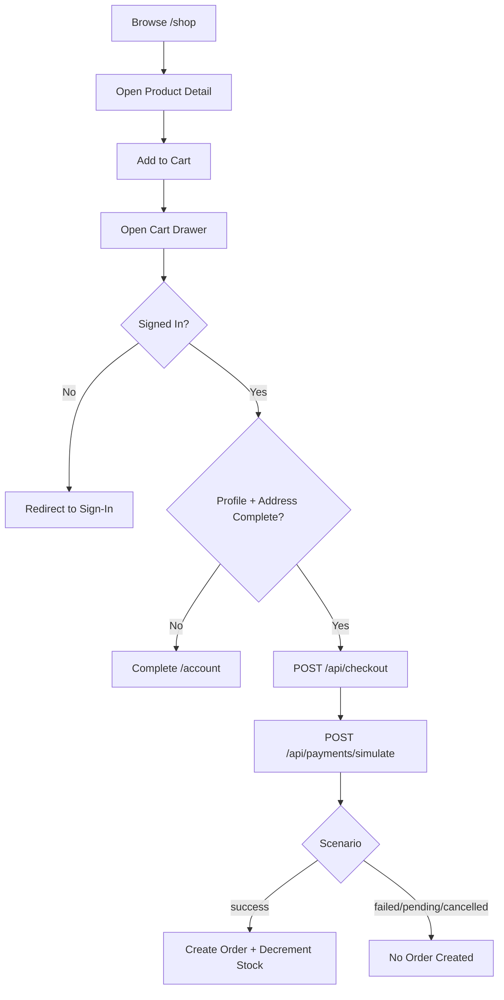
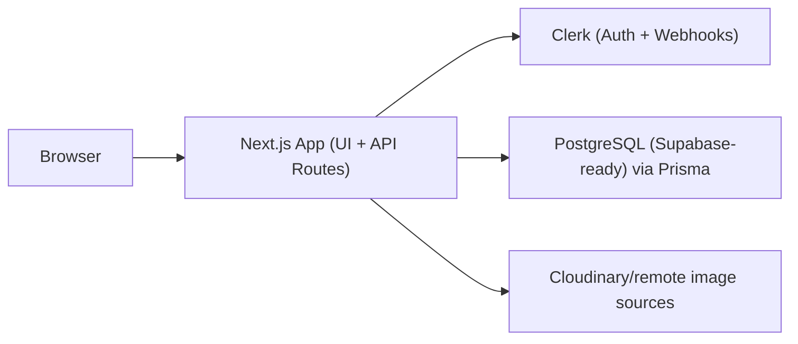

# BlushCo Project Documentation (Comprehensive)

## 1) Project Overview

BlushCo is a simulation-first e-commerce platform built as an academic cloud project.  
It combines a modern storefront with a secure backend architecture and a full simulated checkout flow (no real payment processing).

### Core goals

- Deliver a polished, high-concept fashion storefront UX.
- Demonstrate production-style backend patterns: auth, validation, transactions, and idempotency.
- Showcase cloud-native architecture suitable for Vercel deployment.
- Keep the payment domain safe for demos by using simulation-only payment states.

---

## 2) Product Vision and Scope

### Vision

Create a fashion e-commerce experience that feels premium and modern while teaching real cloud/backend engineering practices.

### In-scope

- Product catalog browsing and category filtering.
- Product detail view with size selection and cart actions.
- Client-side cart persistence (user-scoped local storage).
- Account profile and multi-address management.
- Simulated checkout and payment result simulation.
- Order creation and order lifecycle tracking.
- Admin APIs for product/category/order management.

### Out-of-scope (current phase)

- Real payment gateway processing.
- Real shipping and fulfillment integrations.
- Full operational observability stack (APM + alerting).

---

## 3) User Roles and Key Journeys

### Roles

- `CUSTOMER`: browse, manage account, checkout simulation, view own orders.
- `ADMIN`: customer privileges + catalog management + cross-user order visibility + order status updates.

### Key journeys

1. Visitor -> sign in -> browse catalog -> add to cart.
2. Signed-in user -> complete account age/profile + shipping address -> simulate checkout.
3. Checkout path -> `/api/checkout` creates pending payment session -> `/api/payments/simulate` updates outcome.
4. On simulated `success`, order + order items are created and stock is decremented transactionally.

---

## 4) Functional Features Implemented

### Storefront

- Hero-led landing page with featured category/product highlights.
- Shop listing with category filters.
- Product detail pages with image gallery, quantity and size controls, and details accordion.
- Cart drawer with subtotal/progress UI and checkout CTA.
- Marquee strip and custom desktop cursor for brand personality.

### Account

- Profile management (`age`, `phone`, `preferredCategories`, `clothingSizes`).
- Address management (create, update default, delete).
- Checkout gating based on profile readiness and selected shipping address.

### Commerce backend

- Product/category CRUD APIs.
- Checkout session creation with server-side cart normalization and price recomputation.
- Payment simulation API with four states: `success`, `failed`, `pending`, `cancelled`.
- Idempotent behavior for checkout/payment paths.
- Order creation from immutable snapshot data.
- Admin order status update endpoint.

### Auth and user sync

- Clerk middleware integration.
- Clerk webhook route to upsert/anonymize user records in Prisma DB.
- Demo auth header fallback support for local/API testing.

### Resilience mode

- Catalog query fallback data path if database access is unavailable.

---

## 5) Information Architecture and Navigation

- `/` Home
- `/shop` Product listing
- `/product/[id-or-slug]` Product detail
- `/account` Account details + addresses
- `/sign-in`, `/sign-up` Authentication
- `/api/*` Backend API surface

---

## 6) Design System and UX Direction

### Visual style

- Brand tone: modern streetwear, editorial, high contrast, bold uppercase typography.
- Color behavior: adaptive palette via CSS variables with light/dark-aware token values.
- Layout language: large hero statements, grid-heavy catalog, high whitespace, strong typographic hierarchy.

### Typography and motion

- Font stack anchored on `IBM Plex Sans`.
- Framer Motion used for:
  - Mobile nav transitions
  - Cart drawer transitions
  - Marquee movement
  - Progress bar animation
  - Custom cursor spring interactions

### UX principles in implementation

- Progressive disclosure: details/shipping accordions on PDP.
- Immediate feedback: add-to-cart success state, checkout message states.
- Access control awareness in UI: sign-in prompts and account-completion messaging.
- Mobile-responsiveness across nav, catalog grids, and product/gallery layouts.

---

## 7) Design Inspiration Notes

The current UI direction appears inspired by:

- High-fashion/streetwear e-commerce (editorial hero + large uppercase typography).
- Minimalist monochrome systems with occasional high-contrast emphasis.
- Premium D2C behavior patterns (immersive imagery, kinetic highlights, sticky product details).

This is inferred from implemented layout/content style and interaction patterns in the codebase.

---

## 8) Wireframes (Low-Fidelity)

### 8.1 Home (`/`)

```text
+----------------------------------------------------------+
| NAV: menu links | logo centered | search/cart/auth       |
+----------------------------------------------------------+
| HERO IMAGE (full viewport)                               |
| BIG HEADLINE + supporting line + Explore Collection CTA  |
+----------------------------------------------------------+
| MARQUEE STRIP                                             |
+----------------------------------------------------------+
| CORE ESSENTIALS CATEGORY GRID (4 cards, first card wide) |
+----------------------------------------------------------+
| FEATURED PRODUCTS GRID                                    |
+----------------------------------------------------------+
| FOOTER                                                    |
+----------------------------------------------------------+
```

### 8.2 Shop (`/shop`)

```text
+----------------------------------------------------------+
| SHOP HEADER + supporting description                      |
+----------------------------------------------------------+
| CATEGORY FILTER PILLS                                     |
+----------------------------------------------------------+
| PRODUCT GRID (cards with image, name, category, price)    |
+----------------------------------------------------------+
```

### 8.3 Product Detail (`/product/[id]`)

```text
+-----------------------------+----------------------------+
| IMAGE GALLERY               | PRODUCT INFO               |
| - primary large image       | - name/price/stock         |
| - secondary images          | - description              |
|                             | - size selector            |
|                             | - quantity stepper         |
|                             | - add to cart CTA          |
|                             | - details/shipping accord. |
+-----------------------------+----------------------------+
```

### 8.4 Cart Drawer

```text
RIGHT SLIDE PANEL
- cart items list
- quantity controls
- simulation mode selector
- shipping address selector
- subtotal + status messages
- simulate checkout CTA
```

### 8.5 Account (`/account`)

```text
SECTION 1: PROFILE
- age, phone, preferred categories, clothing sizes
- checkout readiness badge

SECTION 2: ADDRESSES
- add address form
- saved addresses list
- make default / delete actions
```

### 8.6 User flow diagram



---

## 9) Technical Stack and Tools

### Frontend

- Next.js App Router (`next@16`)
- React (`react@19`)
- TypeScript (`strict` mode)
- Tailwind CSS v4
- Framer Motion
- Lucide icons

### Backend

- Next.js Route Handlers for API layer
- Prisma ORM (`prisma@6`, `@prisma/client@6`)
- PostgreSQL (Supabase-ready schema)
- Clerk auth/session/webhooks

### Developer tooling

- ESLint (Next core-web-vitals + TypeScript config)
- Prisma migrations + seed script
- Playwright dependency present (E2E framework available for expansion)

---

## 10) Data Architecture

### Primary entities

- `User`, `UserProfile`, `Address`
- `Category`, `Product`
- `Order`, `OrderItem`
- `PaymentSession`

### Key model decisions

- `priceMinor` used for monetary precision.
- `OrderItem` captures immutable product snapshots.
- `PaymentSession` stores `cartSnapshot` and shipping snapshot for consistency and auditability.
- `idempotencyKey` and `externalReference` uniqueness guard replay and duplicates.

---

## 11) API Inventory

### Customer/account

- `GET/PUT /api/account/profile`
- `GET/POST /api/account/addresses`
- `PATCH/DELETE /api/account/addresses/[id]`

### Catalog

- `GET/POST /api/products`
- `GET/PATCH/DELETE /api/products/[id]`
- `GET/POST /api/categories`
- `PATCH/DELETE /api/categories/[id]`

### Checkout/payments/orders

- `POST /api/checkout`
- `POST /api/payments/simulate`
- `GET /api/orders`
- `GET /api/orders/[id]`
- `PATCH /api/admin/orders/[id]/status`

### Integrations

- `POST /api/webhooks/clerk`

---

## 12) Security Perspective

### Controls currently implemented

- Authentication enforcement via Clerk and server-side auth checks.
- Role checks for admin-only operations.
- Server-side checkout validation:
  - cart shape + quantity constraints
  - product existence/activity checks
  - stock checks
  - single-currency cart validation
  - server-side amount recomputation (client values not trusted)
- Idempotency behavior on checkout/payment flows.
- Transactional order creation and stock decrement on success path.
- Resource ownership checks (e.g., users can only access/update their own records/orders).
- Structured API error handling with typed status codes.

### Security hardening recommendations (next phase)

- Add request schema validation library (e.g., Zod) to every API route.
- Add rate limiting for sensitive endpoints (`checkout`, `simulate`, auth-adjacent APIs).
- Add webhook replay protection and event-id deduplication persistence.
- Add audit log table for admin mutations and payment state transitions.
- Add CSP/security headers and bot-abuse controls.
- Add periodic dependency vulnerability scanning and CI gate.

---

## 13) Cloud Architecture Perspective

### Current architecture shape



### Why this architecture is cloud-friendly

- Single codebase for UI and API allows easy serverless deployment.
- Prisma + Postgres model is portable and cloud-native.
- Authentication delegated to managed identity provider (Clerk).
- Stateless frontend/API handlers align with Vercel’s execution model.

---

## 14) Deployment Plan (Vercel)

This project is a strong fit for Vercel deployment.

### Proposed deployment flow

1. Connect Git repo to Vercel project.
2. Configure environment variables in Vercel (production + preview).
3. Provision/manage Postgres (Supabase) and run Prisma deploy migrations.
4. Set Clerk webhook endpoint to `https://<domain>/api/webhooks/clerk`.
5. Validate end-to-end checkout simulation in production preview.

### Environment variable classes

- Public (`NEXT_PUBLIC_*`): safe client-side values only.
- Server-only secrets: DB URLs, Clerk secret/webhook secret, API secrets.

### Post-deploy checks

- Auth flows (`/sign-in`, `/sign-up`, protected account access).
- Product and category API reads.
- Checkout simulation for `success`, `failed`, `pending`, `cancelled`.
- Order retrieval and admin update flows.

---

## 15) Dockerization Plan (Future)

You noted Dockerization is planned. For this architecture, a practical approach is:

### 15.1 Development docker-compose

- `app` service: Next.js dev server with mounted source.
- `db` service: PostgreSQL container for local parity.
- Optional: `prisma-studio` service for data inspection.

### 15.2 Production Docker image

- Use a multi-stage Dockerfile:
  - `deps` stage: install dependencies.
  - `builder` stage: run `next build`.
  - `runner` stage: copy standalone build output and run as non-root.

### 15.3 Note on Vercel + Docker together

- If you deploy directly on Vercel, Docker is not required for hosting itself.
- Docker is still highly useful for:
  - consistent local development
  - CI reproducibility
  - portability to other infra (ECS, Fly.io, K8s, etc.)

### 15.4 Suggested sequence

1. Finalize Vercel deployment first.
2. Add Docker-based local parity next.
3. Add CI pipeline that builds/tests both native and Docker paths.

---

## 16) Quality, Testing, and Operations

### Current state

- Linting configured.
- Prisma migrations and seeding in place.
- No broad automated test suite is visible yet in repository structure.

### Recommended additions

- Unit tests for checkout normalization and price/stock validation.
- Integration tests for checkout + payment transitions.
- E2E tests (Playwright) for happy path and failure scenarios.
- Structured logs for critical operations (checkout, payment transitions, admin changes).
- Uptime/error monitoring (Vercel logs + external observability service).

---

## 17) Risks and Mitigations

### Risks

- Demo header fallback auth can be misused if left enabled broadly in production.
- Missing centralized schema validation can produce inconsistent API behavior.
- Insufficient rate limiting may expose simulation endpoints to abuse.

### Mitigations

- Gate demo fallback by environment and remove in production.
- Introduce shared validation schemas and strict request parsing.
- Add IP/user-based throttling and abuse monitoring.

---

## 18) Future Roadmap

### Phase 1 (immediate)

- Deploy to Vercel with secure env management.
- Add production checklists and smoke tests.
- Add baseline test coverage for checkout and orders.

### Phase 2

- Dockerize dev + production build flow.
- Introduce CI (lint, typecheck, tests, Prisma checks).
- Add stronger observability and audit logging.

### Phase 3

- Real payment provider abstraction (while preserving simulation mode for demos).
- Inventory reservations and advanced order workflows.
- Recommendation engine using profile/category preferences.

---

## 19) Quick Command Reference

```bash
npm run dev
npm run build
npm run start
npm run lint
npm run db:generate
npm run db:migrate:dev
npm run db:migrate:deploy
npm run db:seed
```

---

## 20) Conclusion

BlushCo already contains the foundation of a full-stack, cloud-ready commerce system with strong academic value: thoughtful UI/UX, realistic backend commerce logic, and clear security-conscious patterns.  
The next strategic step is exactly what you noted: deploy on Vercel, then formalize Dockerization for environment parity and long-term portability.
